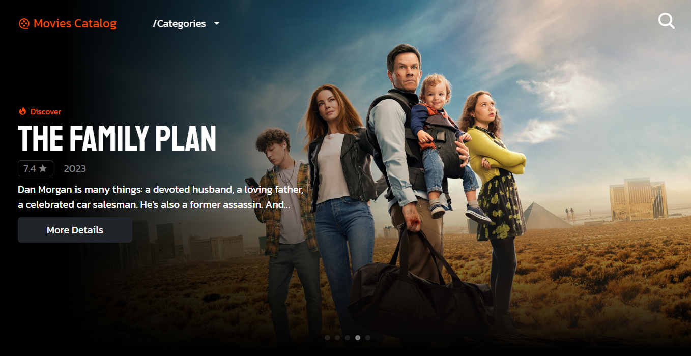

# @Movies Catalog

https://movies-catalog-sage.vercel.app

Este projeto foi criado com React 18.2.0 e node 18.

## Sobre o Projeto
Este projeto consiste em um catálogo de filmes onde os usuários podem conhecer novos filmes baseados em categorias, novidades populares ou avaliação geral do público.

Nesse projeto foi utilizada a [TMDB API](https://developer.themoviedb.org/reference/intro/getting-started) como fonte de recursos.

## Tecnologias utilizadas
- Typescript
- React
- Axios
- Styled-Components
- SwiperJs
- Infinite Scroll
- React Bootstrap

## Autor
Lucas Campos

Linkedin: https://www.linkedin.com/in/lucascamposdev/

E-mail: lucasprestodev@gmail.com
